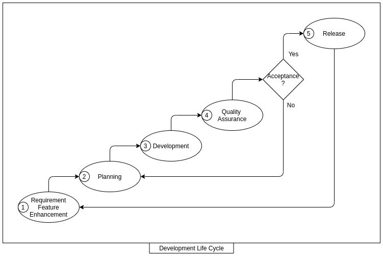

# Ideation

Ideation about Software Engineering and implementation of main features.

## Software Development Life Cycle

* Requirement Analysis
* Planning
* Development
* Quality Assurance
* Release

## To Do

* Expand the details on Architecture and Development diagrams.
* Review the tooling(pre-commit, check-style, sonar-lint and others).
* Apply the tools selected to the project.