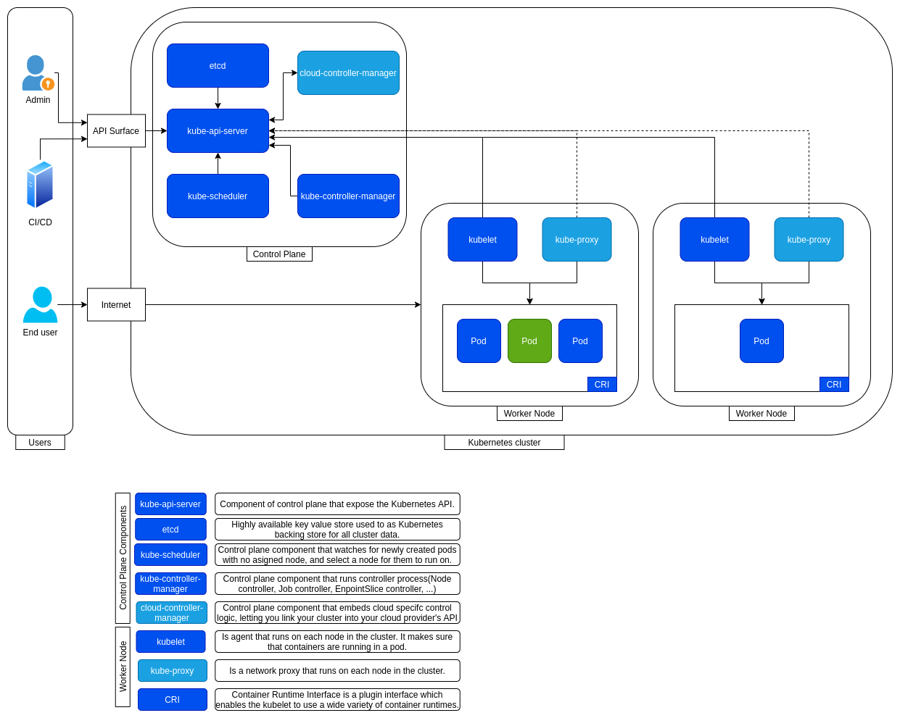

# Infrastructure Selection

Now days we have several options where we can run an application, the decision about which option fits with the necessity  
will depend on several factors like:

* Platform/Technology knowledge.
* Infrastructure budget.
* Time to market.
* Non functional requirements.
* Compliance requirements.

So in each case it's needed a deeper analysis to choose the correct one. Nxt we will document the main current option.

## Kubernetes

Next we will explore kubernetes architecture:

### Notes

* General architecture (Details in the diagram)
  * We can talk with k8s in two ways, imperative(kubectl commands) and declarative(yml files).
  * API Sever
    * Validate identity with AuthN(could be plugin other IdP implementations)
      * Service account
    * Validate permissions with AuthZ
* Users (Installer, Admin, Developer, User)
* Namespaces
* []
